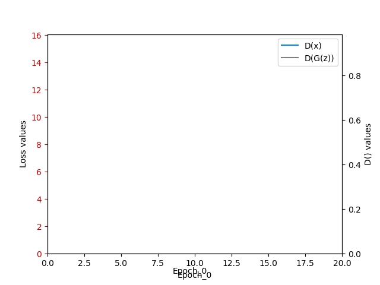
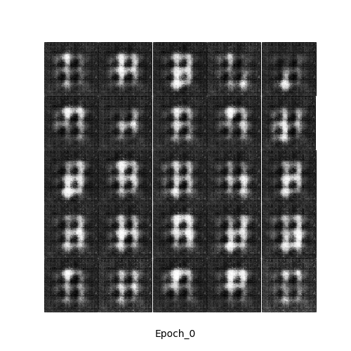

# week2 project: Deep Convolution Generative Adversarioal Networks (DCGAN)

[Goal:] to implement the paper [Unsupervised Representation Learning with Deep Convolutional Generative Adversarial Networks](http://arxiv.org/abs/1511.06434)

### usage:
run experiments with `python experiments/<python script>`

### Initial Results
* For learning rate = 0.0002 (Adam optimizer), batch size = 128, # of epochs = 20:
<table align='center'>
<tr align='center'>
<td> GAN losses</td>
<td> Generated images</td>
</tr>
<tr>
<td>
<td>
</tr>
</table>

## Tabel of Contents
* [Experiments and Results](report.md)  
* [ErrorLog](errorlog.md)

## references: 
https://github.com/togheppi/DCGAN/blob/master/README.md
